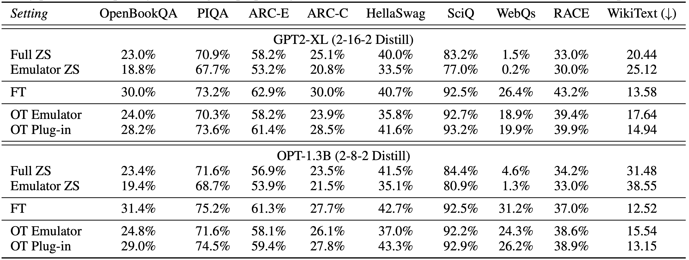
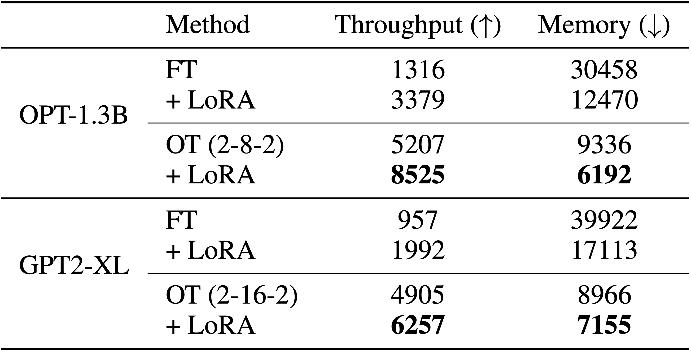

# Offsite-Tuning: Transfer Learning without Full Model [[paper]()]


## Abstract

Transfer learning is important for foundation models to adapt to downstream tasks.
However, many foundation models are proprietary, so users must share their data with model owners to fine-tune the models, which is costly and raise privacy concerns. Moreover, fine-tuning large foundation models is computation-intensive and impractical for most downstream users.
In this paper, we propose Offsite-Tuning, a privacy-preserving and efficient transfer learning framework that can adapt billion-parameter foundation models to downstream data without access to the full model.
In offsite-tuning, the model owner sends a light-weight adapter and a lossy compressed emulator to the data owner, who then fine-tunes the adapter on the downstream data with the emulator's assistance.
The fine-tuned adapter is then returned to the model owner, who plugs it into the full model to create an adapted foundation model. 
Offsite-tuning preserves both parties' privacy and is computationally more efficient than the existing fine-tuning methods that require access to the full model weights.
We demonstrate the effectiveness of offsite-tuning on various large language and vision foundation models.
Offsite-tuning can achieve comparable accuracy as full model fine-tuning while being privacy-preserving and efficient, achieving 6.5x speedup and 5.6x memory reduction.

## Usage

### Setup
```bash
conda create -n offsite python
conda activate offsite
pip install torch==1.12.1+cu113 torchvision==0.13.1+cu113 torchaudio==0.12.1 --extra-index-url https://download.pytorch.org/whl/cu113
pip install transformers accelerate datasets evaluate wandb scikit-learn scipy timm
pip install lm-eval

python setup.py develop
```

### Reproduce our results

In this repository, you will find all the necessary components to reproduce the results from our research. The instructions are outlined below:

1. Core Code: The core code for Offsite-Tuning can be found in the `offsite_tuning` folder.
2. Scripts: All the scripts used to produce the paper results can be found in the `scripts` folder.
3. Emulators: The emulators we distilled can be found in the `emulators` folder.
4. Pretrained Checkpoint: The pre-trained checkpoint used in this research can be found in the `models` folder.
5. Vision Downstream Datasets: The scripts to set up the vision downstream datasets used in the research can be found in the `datasets` folder.

## Results

- Comparing existing fine-tuning approaches (top and middle) and  Offsite-Tuning (bottom). (a) Traditionally, users send labeled data to model owners for fine-tuning, raising privacy concerns and incurring high computational costs. (b) Model owner sending the full model to the data owner is not practical, which threatens the ownership of the proprietary model, and it's not affordable for users to fine-tune the huge foundation model due to resource constraints. (c) Offsite-tuning offers a privacy-preserving and efficient alternative to traditional fine-tuning methods that require access to full model weights.


- On 1-billion scale language models, Offsite-tuning (OT Plug-in) improves zero-shot (ZS) performance across all tasks, with only slight decreases compared to full fine-tuning (FT). Also, a consistent performance gap is observed between the emulator fine-tuning and plug-in, indicating offsite-tuning effectively preserves the privacy of the original proprietary model (users can not use the emulator to achieve the same performance).


- Offsite-tuning also works on language models over 6-billion parameters.


- Offsite-tuning also works on vision foundation models.


- Offsite-Tuning significantly increase the fine-tuning throughput and reduce the memory footprint compared to the existing fine-tuning methods.


## Citation

If you find Offsite-Tuning useful or relevant to your research, please kindly cite our paper:

```bibtex
@article{xiao2023offsite,
  title={Offsite-Tuning: Transfer Learning without Full Model},
  author={Xiao, Guangxuan and Lin, Ji and Han, Song},
  journal={arXiv},
  year={2023}
}
```